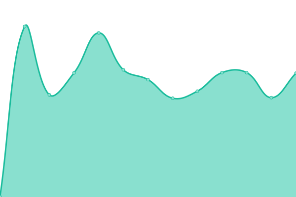
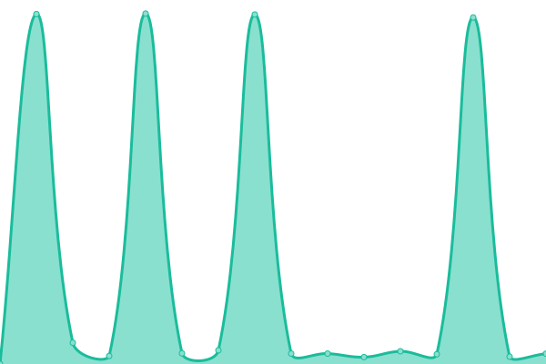
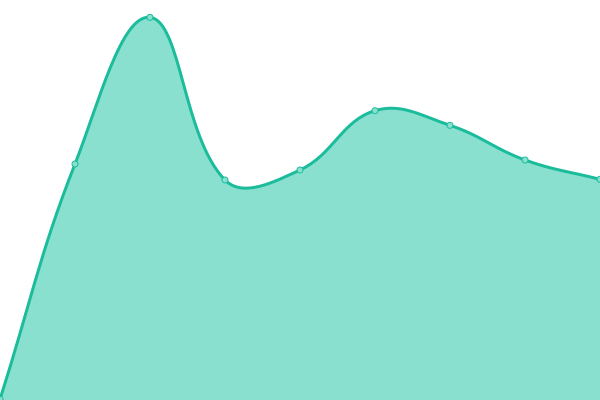

# [📈 Live Status](https://aimages-ai.github.io/upptime): <!--live status--> **🟩 All systems operational**

<!--start: status pages-->
<!-- This summary is generated by Upptime (https://github.com/upptime/upptime) -->
<!-- Do not edit this manually, your changes will be overwritten -->
<!-- prettier-ignore -->
| URL | Status | History | Response Time | Uptime |
| --- | ------ | ------- | ------------- | ------ |
|  [Web App Backend](https://backend.tensorpix.ai/api/statistics/) | 🟩 Up | [web-app-backend.yml](https://github.com/tensorpix/upptime/commits/HEAD/history/web-app-backend.yml) | 

 4294ms
     
 | 

<a href="https://tensorpix.github.io/upptime/history/web-app-backend">100.00%</a>
    

|  [Web app Frontend](https://app.tensorpix.ai) | 🟩 Up | [web-app-frontend.yml](https://github.com/tensorpix/upptime/commits/HEAD/history/web-app-frontend.yml) | 

 164ms
     
 | 

<a href="https://tensorpix.github.io/upptime/history/web-app-frontend">100.00%</a>
    

|  [Landing](https://tensorpix.ai) | 🟩 Up | [landing.yml](https://github.com/tensorpix/upptime/commits/HEAD/history/landing.yml) | 

 5284ms
     
 | 

<a href="https://tensorpix.github.io/upptime/history/landing">100.00%</a>
    

|  [Strapi CMS](https://cms.tensorpix.ai) | 🟩 Up | [strapi-cms.yml](https://github.com/tensorpix/upptime/commits/HEAD/history/strapi-cms.yml) | 

 554ms
     
 | 

<a href="https://tensorpix.github.io/upptime/history/strapi-cms">100.00%</a>
    

|  [Companion Uploader](https://companion.tensorpix.ai) | 🟩 Up | [companion-uploader.yml](https://github.com/tensorpix/upptime/commits/HEAD/history/companion-uploader.yml) | 

 451ms
     
 | 

<a href="https://tensorpix.github.io/upptime/history/companion-uploader">100.00%</a>
    

|  [Hyperx Cluster Server](https://hyperx.tensorpix.ai/healthz) | 🟩 Up | [hyperx-cluster-server.yml](https://github.com/tensorpix/upptime/commits/HEAD/history/hyperx-cluster-server.yml) | 

 450ms
     
 | 

<a href="https://tensorpix.github.io/upptime/history/hyperx-cluster-server">100.00%</a>
    

|  [Hyperx Preview Server](https://preview.hyperx.tensorpix.ai/healthz) | 🟩 Up | [hyperx-preview-server.yml](https://github.com/tensorpix/upptime/commits/HEAD/history/hyperx-preview-server.yml) | 

 426ms
     
 | 

<a href="https://tensorpix.github.io/upptime/history/hyperx-preview-server">100.00%</a>
    

|  [VJS Production](https://vjs.tensorpix.ai/health) | 🟩 Up | [vjs-production.yml](https://github.com/tensorpix/upptime/commits/HEAD/history/vjs-production.yml) | 

 528ms
     
 | 

<a href="https://tensorpix.github.io/upptime/history/vjs-production">100.00%</a>
    

<!--end: status pages-->

## 📄 License

- Powered by: [Upptime](https://github.com/upptime/upptime)
- Code: [MIT](./LICENSE) © [Upptime](https://upptime.js.org)
- Data in the `./history` directory: [Open Database License](https://opendatacommons.org/licenses/odbl/1-0/)
